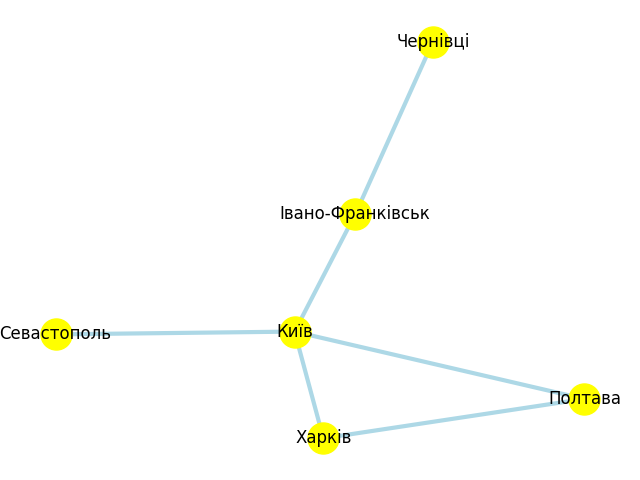

# Основні концепції графів

## 📌 Опис завдань

1. Візуалізуйте створений граф, проведіть аналіз основних характеристик (наприклад, кількість вершин та ребер, ступінь вершин).
2. Порівняйте результати виконання DFS і BFS алгоритмів для цього графа, висвітлить різницю в отриманих шляхах. Поясніть, чому шляхи для алгоритмів саме такі.

Для реалізації завдань я створила граф, що візуалізує деякі міста України, в яких я бувала. Вага - це відстань між містами.

## 🔎 Аналіз результатів

### 1. Аналіз основних характеристик:

- **Вид графа:** Неорієнтований, оскільки рух можливий у обидва боки.
- **Ваговий:** Ваги ребер відповідають фізичній відстані між містами в кілометрах.
- **Кількість вершин:** Шість
- **Кількість ребер:** Шість
- **Найвищий ступінь:** Вершина **"Київ"** має найбільшу кількість зв'язків (4). Це вказує на те, що столиця є центральним транспортним хабом у цій моделі. Більшість маршрутів проходять через неї.
- **Середній ступінь:** Вершини **"Харків"**, **"Полтава"**, **"Івано-Франківськ"** мають ступінь 2. Вони слугують транзитними вузлами.
- **Найнижчий ступінь:** Вершини **"Чернівці"** та **"Севастополь"** мають ступінь 1. Це "тупикові" точки в рамках даної моделі, дістатися до яких можна лише через один сусідній вузол.
- **Структура:** Граф є **зв'язним**, бо між будь-якими двома містами існує шлях. Ізольованих вершин немає. Проте, через деревоподібну структуру (мала кількість циклів), видалення вузла "Київ" призведе до розпаду графа на кілька ізольованих компонент, що підтверджує його критичну важливість для цілісності мережі.

### 2. Порівняння алгоритмів DFS та BFS:

Для порівняння алгоритмів було обрано шлях від міста **"Івано-Франківськ"** до міста **"Харків"**.

### Результати:

- **BFS:** `['Івано-Франківськ', 'Київ', 'Харків']`
- **DFS:** `['Івано-Франківськ', 'Київ', 'Харків']`

### Висновки:

У даному випадку і при виборі інших міст - обидва алгоритми завжди знаходили однаковий шлях, але **причини цього мають бути різні**:

1.  **Алгоритм BFS (Пошук у ширину):**
    Знайшов цей маршрут, тому що він є **найкоротшим** за кількістю ребер (пересадок). BFS досліджує граф пошарово, тому він гарантовано знаходить шлях з найменшою кількістю проміжних вузлів.

2.  **Алгоритм DFS (Пошук у глибину):**
    Знайшов цей маршрут через особливості порядку обходу сусідів. У вершині "Київ" алгоритм обрав напрямок "Харків" раніше, ніж "Полтава".

    **Важливо:** Той факт, що DFS знайшов оптимальний шлях скоріш за все повʼязаний з невеликою кількістю вершин. На відміну від BFS, алгоритм DFS **не гарантує** знаходження найкоротшого шляху. Якби порядок сусідів і кількість вершин була б іншою, DFS міг би обрати шлях через Полтаву (`Івано-Франківськ -> Київ -> Полтава -> Харків`).

### Підсумок

BFS є оптимальним для знаходження найкоротших шляхів у незважених графах. DFS, хоч і дав такий самий результат у цьому експерименті, загалом призначений для інших задач (наприклад, перевірка зв'язності або пошук циклів), оскільки його шляхи залежать від випадкового порядку вибору вершин.
